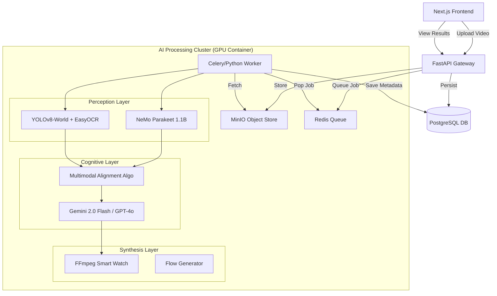

# TrainFlow AI: Enterprise Multimodal Workflow Agent

**Version**: 2.5 (GB10-Optimized)
**Author**: TrainFlow Engineering Team

TrainFlow AI is an advanced "Field-to-Office" automation system that transforms raw video footage of industrial procedures into verifiable, step-by-step training guides. It leverages a sophisticated multimodal pipeline (ASR, Computer Vision, LLM Reasoning) to autonomously "watch" a video, understand the intent, and generate a standardized Standard Operating Procedure (SOP) with visual evidence.

---

## 🚨 Critical Development Rules

All contributors must adhere to these strict engineering standards:

1.  **NO MOCK DATA**: The system must always run against the real containerized stack. Never hardcode JSON responses or use "dummy" arrays in the frontend. All data must originate from the PostgreSQL database or the actual AI pipeline.
2.  **DOCKER EXCLUSIVE**: All code execution, database migrations, and service orchestration must occur within the Docker containers. Do not run Python scripts or npm commands on the host machine directly.
    *   *Correct*: `docker exec trainflow-backend python3 script.py`
    *   *Incorrect*: `python3 script.py`
3.  **REAL FILE I/O**: Video uploads and processing must use the actual MinIO/S3 storage backend and local volume mounts. No bypassing the storage layer.
4.  **SEQUENTIAL PROCESSING**: The worker pipeline requires exclusive GPU access. Jobs are processed strictly sequentially (FIFO) to prevent VRAM OOM errors.

---

## 🏗 System Architecture

The system follows a microservices event-driven architecture optimized for NVIDIA Grace Blackwell (GB10) infrastructure.



---

## 🛠 Technology Stack

### Frontend
-   **Framework**: Next.js 14 (App Router)
-   **Styling**: TailwindCSS + Lucide Icons + Framer Motion
-   **State**: React Hooks (SWR/Fetch) - *No Redux/global stores to keep it lightweight.*
-   **Visualization**: React Flow (for verify interactive graphs).

### Backend API
-   **Framework**: FastAPI (Python 3.10+)
-   **Database**: PostgreSQL 15 (SQLAlchemy ORM)
-   **Queue**: Redis (Pub/Sub + List)
-   **Storage**: MinIO (S3 Compatible)

### AI & Machine Learning (The "Brain")
The core IP resides in `backend/app/services/`.

1.  **ASR (Automatic Speech Recognition)**
    *   **Model**: `nvidia/parakeet-ctc-1.1b` (NeMo Toolkit)
    *   **Why**: Optimized for industrial noise robustness and timestamp precision.
    *   **Module**: `services/asr.py`

2.  **Computer Vision (CV)**
    *   **Object Detection**: `YOLOv8-World` (Real-time Open Vocabulary Detection)
    *   **OCR**: `EasyOCR` (GPU-accelerated) for screen text reading.
    *   **Module**: `services/cv.py`

3.  **LLM Reasoning**
    *   **Model**: Google Gemini 2.0 Flash (via OpenRouter) or OpenAI GPT-4o.
    *   **Role**: Intent understanding, step segmentation, logic inference (Decision Nodes), and JSON structuring.
    *   **Module**: `services/llm.py` & `services/field_assistant.py`

4.  **Multimodal Alignment**
    *   **Algorithm**: Local proprietary fuzzy-match algorithm (`alignment.py`).
    *   **Function**: Correlates ASR timestamps with CV detection events (e.g., "User says 'Click Next' AND OCR sees 'Next' button at t=4.5s").

---

## 📂 Implementation Modules

### 1. Ingestion (`routers/api.py`, `storage.py`)
-   Videos are uploaded via `POST /api/uploads/`.
-   Files are streamed to MinIO (`trainflow-bucket`).
-   DB Record (`Video`) created with status `PENDING`.
-   Job ID pushed to Redis channel `video_jobs`.

### 2. The Worker (`worker.py`)
-   A dedicated process listening to Redis.
-   **Loop**:
    1.  **Download**: Fetches raw MP4 from MinIO.
    2.  **Transcribe**: Runs NeMo Parakeet to get timestamped words.
    3.  **Analyze**: Runs YOLO/OCR on sampled frames (1fps or scene-change detection).
    4.  **Align**: Merges ASR and CV streams into "Raw Action Candidates".
    5.  **Reason**: Sends candidates to LLM to refine into "Training Steps" (Action, Result, Notes).
    6.  **Clip**: Uses FFmpeg to slice the original video into micro-segments for each step.
    7.  **Save**: Commits `ProcessFlow` and `TrainingStep` records to Postgres.

### 3. Field Assistant (`services/field_assistant.py`)
-   A specialized RAG module that answers user queries about specific steps.
-   **Context**: Injects the current visible step and flow history into the prompt.
-   **Capabilities**: Can identify safety risks ("Is this high voltage?") based on CV tags.

---

## 🗄 Data Models (`models/models.py`)

1.  **Video**
    *   `id`: PK
    *   `status`: PENDING, PROCESSING, COMPLETED, FAILED
    *   `transcription_log`: Dump of raw ASR JSON.
    *   `ocr_log`: Dump of raw OCR JSON.

2.  **ProcessFlow**
    *   `id`: PK
    *   `video_id`: FK
    *   `graph_data`: JSON blob for Flow visualizer.
    *   `approval_status`: DRAFT, REVIEWED, PUBLISHED.

3.  **TrainingStep**
    *   `id`: PK
    *   `flow_id`: FK
    *   `step_number`: Int
    *   `action_details`: Text (LLM generated).
    *   `screenshot_path`: Path to generated thumbnail (served via static mount).
    *   `video_clip_path`: Path to step-specific video loop.

---

## 🚀 Setup & Rebuild

To rebuild the entire system from source provided in this repo:

1.  **Details**:
    *   Ensure NVIDIA Drivers and NVIDIA Container Toolkit are installed.
    *   Define `.env` with `OPENAI_API_KEY` (or OpenRouter equiv).

2.  **Launch**:
    ```bash
    docker-compose up --build -d
    ```

3.  **Access Points**:
    *   **Frontend**: `http://localhost:3000`
    *   **Backend API Docs**: `http://localhost:2027/docs`
    *   **MinIO Console**: `http://localhost:9001`
    *   **Database**: Port `5432`

## 🧪 Testing

Run endpoints via the Docker container:
```bash
docker exec -it trainflow-backend pytest tests/
```

To probe a specific video processing stage manually (for debugging):
```bash
docker exec -it trainflow-backend python3 -m app.worker --debug-video-id 123
```

---
**Prepared for**: Darius Elder
**SRS Compliance**: Partial (See Gap Audit)
