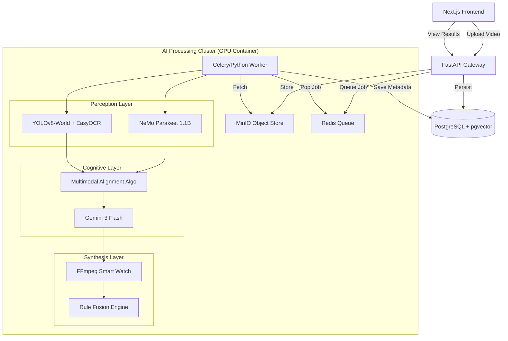

# TrainFlow AI: Enterprise Multimodal Workflow Agent

**Version**: 5.13 (Curriculum Architect Release)
**Author**: TrainFlow Engineering Team

TrainFlow AI is an advanced "Field-to-Office" automation system that transforms raw video footage of industrial procedures into verifiable, step-by-step training guides. It leverages a sophisticated multimodal pipeline (ASR, Computer Vision, LLM Reasoning) and a **Knowledge Engine** to autonomously "watch" a video, understand the intent, and generate succinct, rule-compliant training modules.

---

## 🚀 Key Features

*   **Autonomous Video Analysis**: Converts MP4s into broken-down process steps with timestamps.
*   **Knowledge Engine (New in V3)**: Ingests PDFs/SOPs, extracts business rules using RAG, and enforces compliance.
*   **Hyper-Guides (New in V3)**: Synthesizes "Perfect Training Guides" by fusing video actions with safety rules.
*   **Smart Player**: Interactive split-screen learning with "Heads Up" instruction overlays.

---

## 🏗 System Architecture

The system follows a microservices event-driven architecture optimized for NVIDIA Grace Blackwell (GB10) infrastructure.



---

## 🛠 Technology Stack

### Frontend
-   **Framework**: Next.js 14 (App Router)
-   **Styling**: TailwindCSS + Lucide Icons + Framer Motion
-   **State**: React Hooks (SWR/Fetch)
-   **Visualization**: React Flow & Smart Player HUD

### Backend API
-   **Framework**: FastAPI (Python 3.10+)
-   **Database**: PostgreSQL 15 + `pgvector` (Vector Search)
-   **Queue**: Redis (Pub/Sub + List)
-   **Storage**: MinIO (S3 Compatible)

### AI & Machine Learning (The "Brain")
The core IP resides in `backend/app/services/`.

1.  **ASR (Automatic Speech Recognition)**
    *   **Model**: `nvidia/parakeet-ctc-1.1b` (NeMo Toolkit)
    *   **Module**: `services/asr.py`

2.  **Computer Vision (CV)**
    *   **Object Detection**: `YOLOv8-World` (Real-time Open Vocabulary Detection)
    *   **OCR**: `EasyOCR` (GPU-accelerated)
    *   **Module**: `services/cv.py`

3.  **LLM Reasoning & Knowledge**
    *   **Model**: Google Gemini 3 Flash Experiment.
    *   **Role**: Intent understanding, Rule Extraction (JSON), and Guide Synthesis.
    *   **Module**: `services/llm.py` & `services/knowledge_ingestor.py`

4.  **Hyper-Learning Engine**
    *   **Algorithm**: "The Zipper" (Fuses Video Steps with Business Rules).
    *   **Module**: `services/training_synthesizer.py`

---

## 📂 Implementation Modules

### 1. Ingestion (`routers/api.py`, `storage.py`)
-   Videos are uploaded via `POST /api/uploads/`.
-   Files are streamed to MinIO (`trainflow-bucket`).
-   DB Record (`Video`) created with status `PENDING`.
-   Job ID pushed to Redis channel `video_jobs`.

### 2. The Worker (`worker.py`)
-   A dedicated process listening to Redis.
-   **Loop**:
    1.  **Download**: Fetches raw MP4 from MinIO.
    2.  **Transcribe**: Runs NeMo Parakeet to get timestamped words.
    3.  **Analyze**: Runs YOLO/OCR on sampled frames (1fps or scene-change detection).
    4.  **Align**: Merges ASR and CV streams into "Raw Action Candidates".
    5.  **Reason**: Sends candidates to LLM to refine into "Training Steps" (Action, Result, Notes).
    6.  **Clip**: Uses FFmpeg to slice the original video into micro-segments for each step.
    7.  **Save**: Commits `ProcessFlow` and `TrainingStep` records to Postgres.

### 3. Field Assistant (`services/field_assistant.py`)
-   A specialized RAG module that answers user queries about specific steps.
-   **Context**: Injects the current visible step and flow history into the prompt.
-   **Capabilities**: Can identify safety risks ("Is this high voltage?") based on CV tags.

---

## 🗄 Data Models (`models/models.py`)

1.  **Video**
    *   `id`: PK
    *   `status`: PENDING, PROCESSING, COMPLETED, FAILED
    *   `transcription_log`: Dump of raw ASR JSON.
    *   `ocr_log`: Dump of raw OCR JSON.

2.  **ProcessFlow**
    *   `id`: PK
    *   `video_id`: FK
    *   `graph_data`: JSON blob for Flow visualizer.
    *   `approval_status`: DRAFT, REVIEWED, PUBLISHED.

3.  **TrainingStep**
    *   `id`: PK
    *   `flow_id`: FK
    *   `step_number`: Int
    *   `action_details`: Text (LLM generated).
    *   `screenshot_path`: Path to generated thumbnail (served via static mount).
    *   `screenshot_path`: Path to generated thumbnail (served via static mount).
    *   `video_clip_path`: Path to step-specific video loop.

4.  **TrainingCurriculum** (New in V5.1)
    *   `id`: PK
    *   `title`: Generated Course Title.
    *   `structured_json`: Complete hierarchical course plan (Modules -> Lessons -> Clips).
    *   `created_at`: Timestamp.

---

## 🧠 Curriculum Architect ("The Brain")

Released in V5.1, the **Curriculum Architect** automates the creation of full training courses from unorganized video dumps.

1.  **Ingestion Strategy**: "Hybrid Smart-Context"
    *   Automatically calculates token count of all ready videos.
    *   **Direct Ingestion**: For contexts < 2M tokens (approx 80 hours of video), feeds *entire* transcripts and OCR logs into the LLM at once.
    *   **Map-Reduce**: (Planned) Summarizes videos first for massive datasets.

2.  **LLM Engine**:
    *   **Model**: `x-ai/grok-4.1-fast` (via OpenRouter).
    *   **Context Window**: 2,000,000 tokens.
    *   **System Prompt**: "World-Class Instructional Designer".

3.  **UI Workflow**:
    *   **Corpus Ingestion**: Bulk upload and status tracking (`/jobs`).
    *   **Generation**: One-click "Generate Course Structure".
    *   **Viewer**: Dedicated interactive Course Plan Viewer (`/curriculum/[id]`).

---

## 🚀 Setup & Rebuild

To rebuild the entire system from source provided in this repo:

1.  **Details**:
    *   Ensure NVIDIA Drivers and NVIDIA Container Toolkit are installed.
    *   Define `.env` with `OPENAI_API_KEY` (or OpenRouter equiv).

2.  **Launch**:
    ```bash
    docker-compose up --build -d
    ```

3.  **Access Points**:
    *   **Frontend**: `http://localhost:3000`
    *   **Backend API Docs**: `http://localhost:2027/docs`
    *   **MinIO Console**: `http://localhost:9001`
    *   **Database**: Port `5432`

## 🧪 Testing

Run endpoints via the Docker container:
```bash
docker exec -it trainflow-backend pytest tests/
```

To probe a specific video processing stage manually (for debugging):
```bash
docker exec -it trainflow-backend python3 -m app.worker --debug-video-id 123
```

---
**Prepared for**: Darius Elder
**SRS Compliance**: Partial (See Gap Audit)
