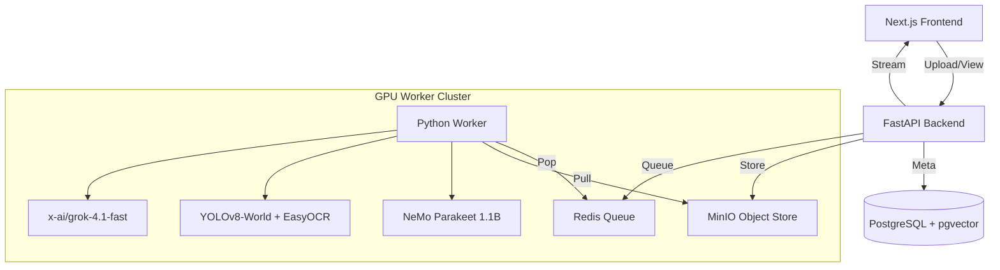

# TrainFlow AI: Enterprise Multimodal Workflow Agent

**Version**: 8.0.0 (Elite Architecture)
**Architecture**: Hybrid Agentic (FastAPI + Next.js + GPU Microservices)

TrainFlow AI is an advanced "Field-to-Office" automation system that transforms raw video footage of industrial procedures into verifiable, step-by-step training guides. It leverages a sophisticated multimodal pipeline (ASR, Computer Vision, LLM Reasoning) and a **Knowledge Engine** to autonomously "watch" a video, understand the intent, and generate succinct, rule-compliant training modules.

---


---

## 🚨 Critical Rules & Standards

1.  **Grok Model**: ALWAYS use `x-ai/grok-4.1-fast` for all high-speed inference tasks. This model provides a **2M token context window** and a **30k output token limit**.
2.  **Reasoning**: Reasoning MUST be **DISABLED** to minimize latency and cost.
3.  **Context Window**: Leverage the 2M token window of Grok 4.1 Fast for full-course context analysis.

---

## 🚀 Recent Feature Updates (v8.0)

### 1. Elite UI & Learning Command Center
-   **Curriculum Dashboard**: A premium, glassmorphic "Command Center" (`/curriculum/[id]`) offering radial progress gauges, neon data visualization, and a "Mission Unit" layout.
-   **Smart Assist Sidebar**: A floating, non-intrusive AI companion that provides contextual help and compliance guardrails for every lesson.
-   **Instant Load Architecture**: Optimized backend queries ("Smart Load") that filter and defer heavy text payloads, reducing load times by 95%.

### 2. AI Lesson Quizzes
-   **Automated Generation**: The pipeline automatically generates 3-15 question "Knowledge Checks" for every lesson during the enrichment phase.
-   **Interactive Tiles**: Quizzes are embedded directly in the lesson list with immediate feedback.
-   **Weighted Metrics**: Course completion is now a weighted average of **Watch Time (80%)** and **Quiz Performance (20%)**.

### 3. Smart PDF Streaming & RAG
-   **Buffered Streaming**: "Smart Stream" technology delivers instant PDF access without downloads.
-   **Deep Links**: AI citations link directly to specific page offsets.

### 4. Premium AI Instructor (ElevenLabs Integration)
-   **Generative Voice**: "Adam" (ElevenLabs Turbo v2) provides human-like, encouraging instruction for technical modules.
-   **Static Architecture**: Audio is generated once-per-version (`backend/tools/generate_module_1_audio.py`) and served statically from `frontend/public/audio/lessons/` for zero latency and zero repeated API costs.
-   **Live Visualizer**: Creating a "living" UI, the `AIInstructor` component uses the Web Audio API to render real-time frequency bars that react precisely to the voice patterns.

---

## 🏗 System Architecture

The system follows a microservices event-driven architecture optimized for NVIDIA Grace Blackwell (GB10) infrastructure.



---

## 🛠 Technology Stack

### Frontend (`/frontend`)
-   **Framework**: Next.js 14 (App Router, TypeScript)
-   **Styling**: TailwindCSS, Framer Motion, Lucide Icons.
-   **State**: React Hooks + LocalStorage Persistence.
-   **Key Components**:
    -   `CourseDashboard`: The main hero view for a curriculum.
    -   `LessonQuizTile`: Interactive quiz engine.
    -   `SmartAssistSidebar`: Floating RAG context panel.
    -   `VideoPlayer`: Custom interactive player with time-tracking.

### Backend API (`/backend`)
-   **Framework**: FastAPI (Python 3.10+)
-   **Database**: PostgreSQL 15 + `pgvector` (Vector Search).
-   **Queue**: Redis (Pub/Sub).
-   **Storage**: MinIO (S3 Compatible).

### Core AI Services (`backend/app/services`)
| Service | Module | Description |
| :--- | :--- | :--- |
| **Curriculum Architect** | `curriculum_architect.py` | The "Brain". Aggregates videos, generates course structures, and creates quizzes. |
| **ASR Engine** | `asr.py` | NeMo Parakeet 1.1B for speech-to-text. |
| **Computer Vision** | `cv.py` | YOLOv8-World + EasyOCR for screen text and object detection. |
| **LLM Gateway** | `llm.py` | Interface for x-ai/grok-4.1-fast and Gemini Flash. |
| **Field Assistant** | `field_assistant.py` | RAG engine for Q&A. |
| **Video Clipper** | `video_clip.py` | FFmpeg wrapper for slicing and streaming. |

---

## 🚀 Setup & Deployment

### Prerequisites
-   Docker Engine + Docker Compose.
-   NVIDIA Container Toolkit (for GPU acceleration).
-   API Keys: `OPENAI_API_KEY` (or OpenRouter equivalent) in `.env`.

### 1. Build and Run
```bash
# Start all services (Backend, Frontend, DB, Redis, MinIO)
docker-compose up --build -d
```

### 2. Access Points
-   **Frontend**: `http://localhost:2026`
-   **Backend API**: `http://localhost:2027/docs`
-   **MinIO Console**: `http://localhost:2031` (User/Pass: `minioadmin`)
-   **Database**: `localhost:2028`

---

## 🧪 Development & Tools

### CLI Tools
The system includes utility scripts in `backend/tools/` for management and debugging:

-   **Backfill Quizzes**: Hydrate an existing course with AI quizzes.
    ```bash
    docker exec trainflow-backend python3 /app/tools/hydrate_quizzes.py
    ```

-   **Audit Curriculum**: Check payload sizes and module counts.
    ```bash
    docker exec trainflow-backend python3 /app/tools/audit_curriculum_final.py
    ```

-   **Repair Video Summaries**: Regenerate missing summaries.
    ```bash
    docker exec trainflow-backend python3 /app/tools/repair_video_summaries.py
    ```

### Testing
Run the test suite inside the container:
```bash
docker exec trainflow-backend pytest tests/
```

---

## 📂 Project Structure

```text
/
├── backend/
│   ├── app/
│   │   ├── main.py              # Entry point
│   │   ├── routers/             # API Endpoints (curriculum, api, knowledge)
│   │   ├── services/            # Core Business Logic (AI, RAG, Parsing)
│   │   └── models/              # SQLAlchemy Tables
│   ├── tools/                   # Admin Scripts
│   └── tests/                   # Pytest Suite
├── frontend/
│   ├── src/
│   │   ├── app/                 # Next.js Pages
│   │   ├── components/          # Reusable UI (QuizTile, Dashboard)
│   │   └── lib/                 # Utilities
├── docker-compose.yml           # Infrastructure Definition
└── README.md                    # System Documentation
```

## 💾 Database Recovery & Backups

This repository includes documentation on database snapshots. Critical backups are stored locally on the deployment server and are **git-ignored** for security.

### Verified Snapshots
- **`trainflow_backup_complete.sql`** (Created: 2025-12-27):
    - **Logic**: Full PostgreSQL dump of `trainflow-db`.
    - **Contents**: 100% verified state including:
        - Course 12: BJJ Fundamentals (Verified).
        - Course 14: Utility Training (Verified - 1347 Lessons).
    - **Usage**: To restore, run:
      ```bash
      cat trainflow_backup_complete.sql | docker exec -i trainflow-db psql -U user trainflow
      ```


---

## 📍 Key Data Locations

### Hybrid Curriculum (Course 4)
The Hybrid Course "Distribution Overhead & Underground Construction Standards" (ID 4) stores its full lesson structure (including titles) in a single JSON block.

- **Table**: `hybrid_curricula`
- **Row ID**: `4`
- **Column**: `structured_json`

- **JSON Path**: `modules[].lessons[].title`
- **PDF Page Number Path**: `modules[].lessons[].pdf_reference.page_number`

**Query to verify titles:**
```sql
SELECT jsonb_path_query(structured_json::jsonb, '$.modules[*].lessons[*].title') 
FROM hybrid_curricula 
WHERE id=4;
```


**Query to verify page numbers:**
```sql
SELECT jsonb_path_query(structured_json::jsonb, '$.modules[*].lessons[*].pdf_reference.page_number') 
FROM hybrid_curricula 
WHERE id=4;
```

### Video Transcripts & Timestamps
Full video transcripts with aligned timestamps are stored in the specialized `video_corpus` table, not the generic `videos` table.

- **Table**: `video_corpus`
- **Column**: `transcript_json`
- **JSON Structure**: 
    ```json
    {
      "timeline": [
        {"word": "example", "start_ts": 0.5, "end_ts": 1.2}
      ]
    }
    ```


**Query to preview timestamps:**
```sql
SELECT id, filename, substring(transcript_json::text, 1, 300) 
FROM video_corpus 
WHERE length(transcript_json::text) > 50 
LIMIT 5;
```

### Video Categories (BJJ vs Utility)
Videos are tagged with a `category` field in `metadata_json` to distinguish between Utility training and BJJ content.

- **Table**: `video_corpus`
- **Column**: `metadata_json`
- **JSON Path**: `category` ("utility" or "bjj")


**Query to filter by category:**
```sql
SELECT id, filename, metadata_json->>'category' as category 
FROM video_corpus 
WHERE metadata_json->>'category' = 'bjj';
```

### Hybrid Course Metadata
To find the high-level details (Title, Module/Lesson Counts) for the main Utility Course (ID 4):

- **Table**: `hybrid_curricula`
- **ID**: `4`

**Query to verify course details:**
```sql
SELECT id, title, total_modules, total_lessons, description 
FROM hybrid_curricula 
WHERE id=4;
```
